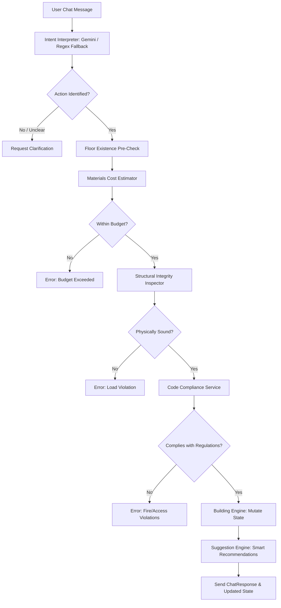

# 🌌 ARCHI-MIND AI — Building Intelligence Planner

Archi-Mind AI is a state-of-the-art interactive building planner application designed to assist structural designers, architects, and civil engineers. It combines a natural language chat interface powered by a **Model Context Protocol (MCP)** orchestration pattern, a real-time **2.5D CSS 3D Building Visualizer**, and detailed **geographical engineering simulations**.

---

## 🏗️ Tech Stack

*   **Frontend**: React (Vite), TypeScript, Vanilla CSS + Tailwind CSS utilities, Lucide React icons, and Firebase Authentication.
*   **Backend**: FastAPI, Pydantic, Python-Dotenv, and Google Generative AI SDK (`gemini-2.0-flash`).
*   **Simulation Core**: Custom mathematical models representing:
    *   **Seismic Load Analysis** (IS 1893-2016 specification)
    *   **Thermal Performance** (EnergyPlus comfort indexing)
    *   **Wind Load Study** (IS 875 Part 3 CFD modeling)
    *   **Electrical Load Flow** (IEEE 37-bus load flow calculation)
*   **Data Registry**: Simulated district database ([karnataka_db.ts](file:///c:/SID/Archi-Mind_AI/viteapp/src/data/karnataka_db.ts)) populated with regional engineering parameters for Karnataka districts (e.g., Bengaluru Urban, Mysuru, Mangaluru, etc.).

---

## ⚡ Core Architecture & Pipeline Flow

The backend orchestrator ([orchestrator.py](file:///c:/SID/Archi-Mind_AI/backend/orchestrator.py)) maintains the authoritative state of the building and runs every user instruction through a multi-step verification pipeline:



### Pipeline Components

1.  **Intent Interpreter** ([intent_interpreter.py](file:///c:/SID/Archi-Mind_AI/backend/services/intent_interpreter.py)): Leverages Gemini to translate natural language inputs (e.g., *"add 2 bedrooms to floor 1"*) into structured commands, falling back to a local regex parser if the Gemini API key is missing.
2.  **Materials Estimator** ([materials_estimator.py](file:///c:/SID/Archi-Mind_AI/backend/services/materials_estimator.py)): Computes concrete, steel, and glass quantities. Applies a foundation premium that scales non-linearly with building height and demurring fees (20% of cost) for room demolition. Fits costs to Indian Lakh (`L`) and Crore (`Cr`) denominations.
3.  **Structural Inspector** ([structural_inspector.py](file:///c:/SID/Archi-Mind_AI/backend/services/structural_inspector.py)): Enforces real-world physics. It prevents floating overhangs (i.e. an upper floor cannot have more rooms than the supporting floor directly underneath it).
4.  **Compliance Service** ([compliance_service.py](file:///c:/SID/Archi-Mind_AI/backend/services/compliance_service.py)): Checks building regulations, including fire safety rules (maximum 6 rooms per floor), height thresholds (maximum 10 floors), empty floor rules, and advisory elevator shafts for buildings exceeding 3 floors.
5.  **Suggestion Engine** ([suggestion_engine.py](file:///c:/SID/Archi-Mind_AI/backend/services/suggestion_engine.py)): Recommends structural balance corrections, alerts the user of critical budget limits, and suggests next building steps dynamically.
6.  **Building Engine** ([building_engine.py](file:///c:/SID/Archi-Mind_AI/backend/services/building_engine.py)): The core state mutation engine that safely updates floor and room layout arrays.

---

## 📂 Project Directory Structure

```text
Archi-Mind_AI/
├── backend/                        # FastAPI Python Backend
│   ├── models/                     # Pydantic schemas
│   │   └── building.py             # Data structures: BuildingState, Room, Floor
│   ├── routes/                     # API routers
│   │   ├── building.py             # Get/configure building state
│   │   └── chat.py                 # Chat and execution pipeline endpoint
│   ├── services/                   # Business logic validation steps
│   │   ├── building_engine.py      # State mutators
│   │   ├── compliance_service.py   # Regulatory code rules
│   │   ├── intent_interpreter.py   # LLM natural language translator
│   │   ├── materials_estimator.py  # Pricing and billing structure
│   │   ├── structural_inspector.py # Civil engineering safety checks
│   │   └── suggestion_engine.py    # Auto-balancing advice builder
│   ├── state/                      # Authoritative state database
│   │   └── store.py                # In-memory session manager
│   ├── main.py                     # Entry point for backend
│   └── requirements.txt            # Python dependencies
│
└── viteapp/                        # React TypeScript Vite Frontend
    ├── src/
    │   ├── components/
    │   │   ├── chat/               # Chat panel & suggestion chips
    │   │   ├── layout/             # Top navigation & sidebar
    │   │   ├── pages/              # Simulation, datasets, & model configs
    │   │   ├── visualizer/         # 2.5D Building Visualizer (CSS 3D Transforms)
    │   │   └── stats/              # Regional engineering telemetry stats
    │   ├── context/                # React state providers (Auth, Building, Theme)
    │   ├── data/                   # Karnataka regional database
    │   └── services/               # HTTP client connectors
```

---

## 🚀 Setting Up & Running Locally

### Prerequisites

*   Python 3.10+
*   Node.js 18+ (npm)

---

### 1. Backend Setup

1.  Navigate to the `backend` directory:
    ```bash
    cd backend
    ```
2.  Create a virtual environment:
    ```bash
    python -m venv venv
    ```
3.  Activate the virtual environment:
    *   **Windows (PowerShell)**:
        ```powershell
        .\venv\Scripts\Activate.ps1
        ```
    *   **macOS/Linux**:
        ```bash
        source venv/bin/activate
        ```
4.  Install the required dependencies:
    ```bash
    pip install -r requirements.txt
    ```
5.  Set up your environment variables. Copy `.env.example` to `.env`:
    ```bash
    cp .env.example .env
    ```
    *Open `.env` and fill in your `GEMINI_API_KEY` (highly recommended for natural language processing, though keywords fallback will act in its absence).*
6.  Start the backend server using Uvicorn:
    ```bash
    uvicorn main:app --reload --port 8000
    ```

The backend API documentation will be available at [http://127.0.0.1:8000/docs](http://127.0.0.1:8000/docs).

---

### 2. Frontend Setup

1.  Navigate to the `viteapp` directory:
    ```bash
    cd ../viteapp
    ```
2.  Install packages:
    ```bash
    npm install
    ```
3.  Create your local environment file. Copy `.env.local.example` to `.env.local`:
    ```bash
    cp .env.local.example .env.local
    ```
    *(Fill in Firebase variables if using user logins).*
4.  Start the local Vite dev server:
    ```bash
    npm run dev
    ```

The frontend will run at [http://localhost:5173](http://localhost:5173).

---

## 📐 Data Schemas & API Documentation

### Key Data Structures

*   **[BuildingState](file:///c:/SID/Archi-Mind_AI/backend/models/building.py#L68)**: Maintains the arrays of [Floor](file:///c:/SID/Archi-Mind_AI/backend/models/building.py#L39) details, [Budget](file:///c:/SID/Archi-Mind_AI/backend/models/building.py#L45) status, design constraints, and mutation history logs.
*   **[Room](file:///c:/SID/Archi-Mind_AI/backend/models/building.py#L32)**: Contains room ID, name, floor occupancy area (sqft), and type (`bedroom`, `bathroom`, `kitchen`, `hallway`, `office`, `store`, `general`).
*   **[ValidationResult](file:///c:/SID/Archi-Mind_AI/backend/models/building.py#L88)**: The return schema of structural and compliance checkers conveying boolean validity, list of violations, and recommended fixes.
